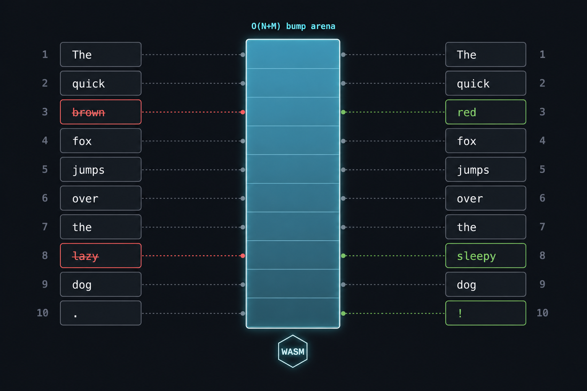

# arena-diff

<p align="center">
  
</p>

Word-level text diff with a **bare C/WASM core**, **O(N+M) arena memory**, and a **zero-copy JS bridge**. Install with `npm install` — works in **Node, browsers, and bundlers** with no extra configuration (WASM is inlined in the package).

Most npm diff libraries are pure JavaScript or Rust→WASM wrappers. **arena-diff** takes a different path: reimplement the diff pipeline in C, compile to bare WASM, and expose a minimal JS API. The goal is to show that careful engineering — including AI-assisted iteration on existing algorithms — can deliver real speed and memory wins over established JS implementations.

| | Typical JS diff | **arena-diff** |
|---|----------------|----------------|
| Engine | JavaScript Myers / DP | **C compiled to WASM** (Clang + wasm-ld, no Emscripten) |
| Memory | Heap growth, often O(N×M) or unpredictable WASM pages | **Single pre-allocated arena O(N+M)** — exact size known up front |
| Token bridge | String arrays marshalled in/out | **`Int32Array` written directly into WASM linear memory** |
| Similar-text strategy | Patience / anchors in JS | **Rolling-hash anchors + LIS**, plus guided-diff guardrails on huge gaps |
| Result hydration | Full `{op, token}[]` every call | **Eager counts from WASM; lazy `ops` getter** |
| Scholarly export | Generic ops or patch files | **TEI P5** (`<add>`, `<del>`, `<subst>`) via `toTeiDiff()` |

Named after the bump arena: at ~30k tokens the working set is **~2.6–2.8 MiB**, not gigabytes (`diff-native`) or a **~3.5 GiB** full DP matrix.

---

## Example

```javascript
import { ArenaDiff, applyDiff, tokenize } from 'arena-diff';

const differ = new ArenaDiff();

const textA = 'The quick brown fox jumps over the lazy dog.';
const textB = 'The quick red fox leaps over the lazy dog.';

const result = await differ.compare(textA, textB);

console.log(result.keepCount);    // unchanged tokens
console.log(result.insertCount);  // added in B
console.log(result.deleteCount);  // removed from A

// Detailed ops materialize only when accessed
for (const { op, token } of result.ops) {
  if (op !== 'keep') console.log(op, token);
}

// Reconstruct B from A
const rebuilt = applyDiff(tokenize(textA), result);
console.log(rebuilt === textB); // true
```

See [TEI P5 export](#tei-p5-export) for scholarly markup output.

On synthetic ~30k-word inputs with ~8% mutation, **arena-diff** finishes in **~35 ms** end-to-end (tokenize + WASM + counts). The next-fastest comparable token-level library in our tests takes **~109 ms** on the same scenario (see [Benchmarks](#benchmarks)).

---

## Install & usage

```bash
npm install arena-diff
```

```javascript
import { ArenaDiff, applyDiff, tokenize } from 'arena-diff';

const differ = new ArenaDiff();
const result = await differ.compare(textA, textB);

// Immediate counts — no extra JS allocation
console.log(result.keepCount, result.insertCount, result.deleteCount);

// Lazy ops: built on first access only
const ops = result.ops;

// Reconstruct B from A
const rebuilt = applyDiff(tokenize(textA), result);
```

### API

| Export | Role |
|--------|------|
| `ArenaDiff` | Main class; `compare(textA, textB)` returns the diff* |
| `applyDiff(tokensA, result)` | Apply ops and return the resulting string |
| `toTeiDiff(result, options?)` | TEI P5 markup for comparing two text versions — see below |
| `tokenize(text)` | Split into words, spaces, punctuation (`Intl.Segmenter`) |
| `serializeDiff(result)` | Canonical string serialization of ops |

\* **`compare()`** returns `keepCount`, `insertCount`, `deleteCount` immediately. The `ops` property is a **lazy getter** — `{ op, token }` objects are created only when you read them.

---

## TEI P5 export

Early releases target **humanities workflows**: comparing prose, translations, and editorial revisions (publishing, philology, textual analysis). Beyond raw ops, `toTeiDiff()` turns a diff into **[TEI P5](https://tei-c.org/)** markup — the standard XML format for digital editions.

Use it when you need to show *what changed* between two versions of a text: proofread vs draft, two translations of the same passage, a revised chapter.

```javascript
import { ArenaDiff, toTeiDiff } from 'arena-diff';

const differ = new ArenaDiff();
const result = await differ.compare(textA, textB);

// Inline fragment — embed in an existing TEI document
const fragment = toTeiDiff(result);

// Standalone TEI XML file
const document = toTeiDiff(result, { wrapDocument: true, title: 'Chapter 3 revision' });
```

For `textA = "The quick brown fox."` and `textB = "The quick red fox jumps."`, the fragment looks like:

```xml
The quick <subst><del>brown</del><add>red</add></subst> fox<add> </add><add>jumps</add>.
```

- **`<subst>`** — a word replaced by another (`<del>` + `<add>`)
- **`<add>`** — text present only in B
- **`<del>`** — text present only in A (standalone deletions, not part of a substitution)

With `wrapDocument: true`, output is a valid TEI document (`<TEI>`, `teiHeader`, `<text><body><p>…</p></body></text>`) ready to save or pipe into TEI-aware tools.

---

## Build (contributors)

The npm package ships a prebuilt WASM engine inlined in `src/wasm/diff.wasm.js`. To rebuild from source:

Requires Clang with `wasm32-unknown-unknown` and `wasm-ld` ([wasi-sdk](https://github.com/WebAssembly/wasi-sdk)).

```bash
export WASI_SDK_PATH=/path/to/wasi-sdk
npm run build
npm test
```

### Repository layout

| Path | Purpose |
|------|---------|
| `src/` | Published library (npm) |
| `native/diff.c` | C diff engine |
| `scripts/build.sh` | WASM build (Clang + wasm-ld, no Emscripten) |
| `test/` | Smoke tests |
| `research/` | Benchmarks and diagnostics (not published) |

---

## How it works

### Hybrid pipeline

```
text A, B  →  JS tokenize (Intl.Segmenter)
           →  intern to Int32Array IDs
           →  zero-copy into WASM linear memory
           →  C engine (Myers + heuristics)
           →  eager counts + lazy ops in JS
```

1. **JS tokenization** — `Intl.Segmenter` splits words, spaces, and punctuation; each unique token gets a 32-bit ID.
2. **Zero-copy bridge** — IDs are written into WASM memory via typed-array views; no string marshalling across the boundary.
3. **C/WASM engine** — linear-space Myers (middle-snake divide-and-conquer), compiled with bare Clang/wasm-ld.
4. **Pre-allocated arena** — all working memory reserved in one O(N+M) bump block before `run_diff()`.

### Algorithm

- **Myers linear-space** — middle-snake recursion (as in git); O((N+M)·D) time, O(N+M) memory on each gap.
- **Global trim** — common prefix/suffix stripped before any heavy work.
- **Hash anchors** — rolling-hash windows between A and B, LIS for a monotonic chain; large speedup on similar texts.
- **Guardrails** — on huge gaps without anchors: O(N+M) guided diff (heuristic, not minimal); on extreme length ratios: mass replace; otherwise Myers on anchored gaps.
- **Per-gap trim (M4)** — each Myers recursion trims matching prefix/suffix inside the gap before the middle-snake search.

On large unmatched gaps the engine may produce a **valid but non-minimal** edit script. A fallback to optimal Myers on the trimmed slice ensures correctness.

### Optimizations

| ID | What | Effect |
|----|------|--------|
| M1 | Flat V-array indexing (no `%`) | ~1.6× on `run_diff` |
| M2 | Hash anchors + LIS | Major speedup on similar texts |
| M4 | Prefix/suffix trim inside each Myers gap | Less work per recursion |
| M5 | Edit buffers `1×(N+M)` instead of `2×` | Smaller arena |
| M6 | `result_ops` packed as `int8` | ~75% fewer bytes for op codes |
| M7 | Lazy `ops` getter; eager counts from WASM | `compare()` without `.ops` ≈ zero JS hydrate cost |

### Memory and large books

Arena size scales **linearly** with token count — predictable before you diff. Unlike libraries that can spike to **gigabytes** of opaque WASM heap growth, arena-diff exposes the exact size via `estimateArenaBytes(n, m)` (WASM `arena_bytes`).

Rough rule: **~90–95 bytes per token** (both sides combined), e.g. ~200k tokens/side → ~35–40 MiB arena.

| Tokens (approx.) | WASM arena | Example |
|------------------|------------|---------|
| ~30k + ~30k | **2.6–2.8 MiB** | Short novella (~15k words/side) |
| ~165k + ~161k | **~15 MiB** | Full novel (~80k words, ~5% revised) |
| ~247k + ~242k | **~22 MiB** | Long novel (~120k words) |
| ~412k + ~403k | **~37 MiB** | Epic (~200k words) |
| ~618k + ~605k | **~55 MiB** | Omnibus (~300k words/side) |

For comparison: a full O(N×M) DP matrix at ~30k tokens needs **~3.5 GiB** (see `research/benchmark-compare.js` baseline). **diff-native** can grow to **gigabytes** of WASM memory on heavy diffs — often unpredictably. arena-diff’s arena is **bounded and known upfront**.

#### On-demand `memory.grow()`

WASM linear memory **starts at 16 MiB** and grows only when the arena needs more. Growth cost is ~microseconds; small diffs never pay for a large buffer.

| Setting | Value |
|---------|--------|
| Initial WASM memory | **16 MiB** |
| Linker max (`build.sh`) | **2 GiB** (wasm32 module ceiling) |
| JS default `maxMemoryBytes` | **none** — grow until runtime / module limit |

```javascript
import { ArenaDiff } from 'arena-diff';

// Default: no artificial cap
const differ = new ArenaDiff();
await differ.init();

const n = tokenize(textA).length;
const m = tokenize(textB).length;
const bytes = await differ.estimateArenaBytes(n, m); // exact arena size

// Optional guardrail for constrained environments (browser tabs, CI, edge workers)
const capped = new ArenaDiff({ maxMemoryBytes: 256 * 1024 * 1024 });
```

If `maxMemoryBytes` is set and the input needs more, `compare()` throws `RangeError` with required vs allowed bytes. If growth hits the WASM module or runtime limit, `compare()` throws with the bytes needed.

---

## Benchmarks

Measured with `npm run research:compare` and `npm run research:memory` (6 synthetic scenarios, seed 42). Token-level libraries timed end-to-end (tokenization included).

### What the scenarios mean

All inputs are **synthetic**: random prose built from a fixed vocabulary (~15 words per line). **15k / 30k** is the word count of each side.

| Label | How B is produced | What it models |
|-------|-------------------|----------------|
| **Similar (~8%)** | B is a **mutated copy of A** — ~8% of tokens changed (substitutions, insertions, deletions) | Light revision: two close drafts (e.g. proofread vs original) |
| **Similar (~50%)** | Same, but **~50%** of tokens changed | Heavy rewrite: same document structure, half the wording different |
| **Dissimilar** | B is a **fresh random text** of the same length (independent seed) — almost no shared tokens | Two unrelated documents of equal size (worst case for LCS / Myers: edit distance ≈ N+M) |

**Similar** stresses anchor-finding and bounded per-gap Myers (like real editorial diffs). **Dissimilar** stresses raw throughput when almost nothing matches — the engine still runs fast because global trim and guardrails avoid pathological O((N+M)·D) blow-ups where possible.

### Time (median, ms)

| Scenario | arena-diff | myers-core | Ratio |
|----------|----------:|----------:|------:|
| Similar 15k (~8%) | **13** | 32 | 2.5× |
| Similar 15k (~50%) | **85** | 102 | 1.2× |
| Dissimilar 15k | **11** | 37 | 3.4× |
| Similar 30k (~8%) | **35** | 109 | 3.1× |
| Similar 30k (~50%) | **101** | 652 | 6.5× |
| Dissimilar 30k | **23** | 61 | 2.7× |

**arena-diff** is the fastest token-level library in every synthetic scenario up to 30k words. The largest gap appears at ~50% mutation / 30k words, where pure Myers struggles with high D; anchors and guardrails keep runtime bounded.

### Large books (~5% revision, vs myers-core-diff)

End-to-end timing (tokenize + diff, median of 7 runs, synthetic prose, seed 42). **myers-core-diff** is the second-fastest library in the main benchmark.

| Words (per side) | arena-diff | myers-core | Winner |
|------------------|----------:|----------:|--------|
| ~40k (novella) | **20 ms** | 43 ms | arena-diff **2.1×** |
| ~80k (novel) | **38 ms** | 94 ms | arena-diff **2.5×** |
| ~100k | **47 ms** | 123 ms | arena-diff **2.6×** |
| ~120k (long novel) | **56 ms** | 154 ms | arena-diff **2.7×** |
| ~200k (epic) | **97 ms** | 294 ms | arena-diff **3.0×** |
| ~250k (omnibus) | **120 ms** | 360 ms | arena-diff **3.0×** |
| ~300k (omnibus) | **147 ms** | 452 ms | arena-diff **3.1×** |

arena-diff stays faster than myers-core across the full range tested (40k–300k words). No default memory cap — arena grows on demand (~55 MiB at 300k words/side). The engine uses **recursive hash anchoring** and **guided diff** on large gaps.

Reproduce: `node --expose-gc research/big-book-benchmark.js`

### Memory vs other libraries (~15k tokens, ~8% similar)

| Library | Memory | Notes |
|---------|--------|-------|
| **arena-diff** | **2.7 MiB** | exact arena in WASM |
| myers-core-diff | ~3.3 MiB | JS heap Δ |
| diff-sequences | ~30 KiB | no full edit script |
| diff-native | ~242 MiB – 3.7 GiB | WASM + heap |

Libraries with tiny heap Δ (`fast-myers-diff`, `diff-sequences`) avoid materializing a full edit script and are much slower on large inputs.

### Reproduce

```bash
npm install
npm run research:compare        # time, all scenarios
npm run research:compare:quick  # 15k only
npm run research:memory         # memory
npm run research:big-book       # large books vs myers-core
node --expose-gc research/diagnose.js   # per-phase breakdown
```

---

## Limitations

**Current scope (v0.1):**

- **Word-level only** — no line-diff or char-diff yet (those matter more for source code and structured files).
- **Not a drop-in jsdiff replacement** — API and output format differ. jsdiff remains the general-purpose standard with broader granularity and patch support.
- **Edit script may be non-minimal** on large gaps where guided diff is used; correctness is guaranteed via round-trip (`applyDiff`), not shortest edit distance.
- **ESM only** — `"type": "module"`. CommonJS consumers need a bundler or dynamic `import()`.
- **Requires `Intl.Segmenter`** — available in Node ≥18 and modern browsers.

**Planned:**

- **Code & tooling:** line-diff and char-diff for source files, logs, and structured text; **unified-diff / patch output** once line-diff exists (standard format for Git and archival interchange).
- Broader API parity with general-purpose diff libraries where it makes sense.

Benchmark numbers in this README are from the included `research/` suite (synthetic inputs, seed 42). Reproduce locally before drawing conclusions for your workload.

---

## License

MIT
